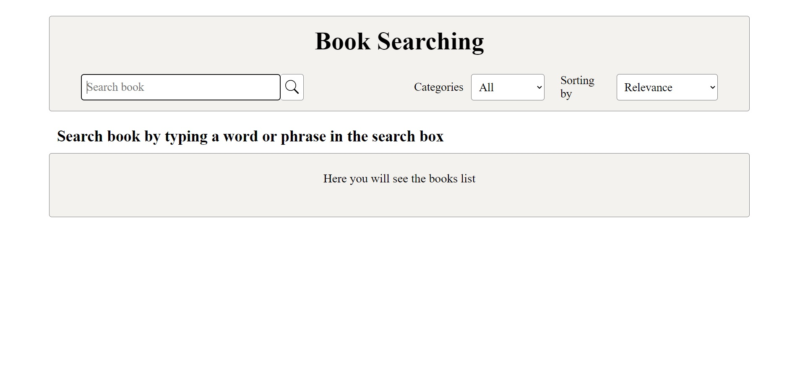
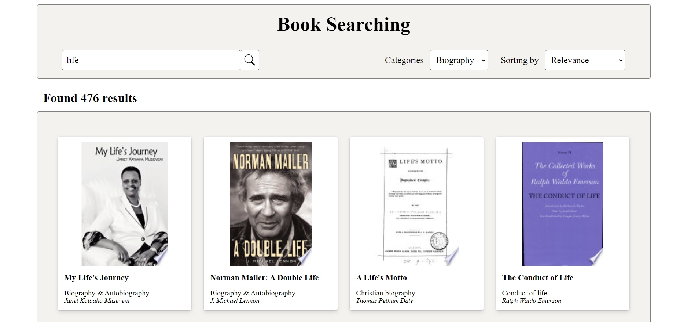
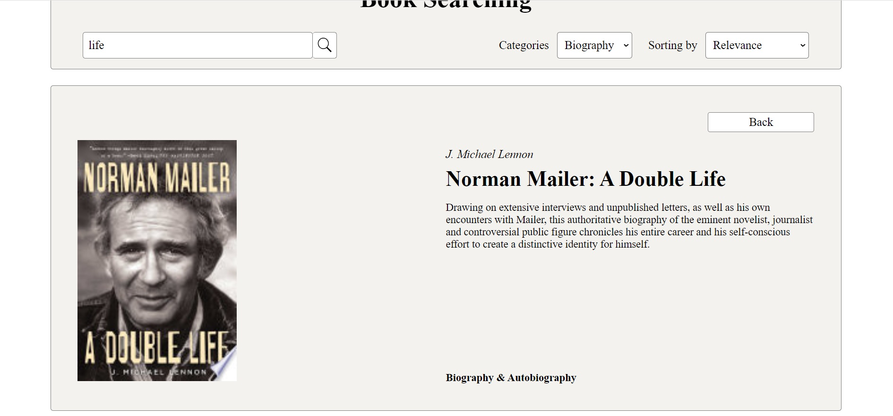

# Поиск книг «Book Searching» (Google Books API)

### Описание: React-приложение для поиска и ознакомления с книгами.

### Использованные технологии:

-   Typescript
-   React
-   Redux Toolkit
-   Ajax
-   Styled Components
-   Сборка с помощью Webpack
-   Babel

### Реализованный функционал:

-   Поиск книг по названию с возможностью подгрузки результатов.

<!--    -->

-   Возможность поиска книг с заданными настройками сортировки и категории.

<!--  -->

-   Страница с описанием выбранной книги.

<!--  -->

